# Hi, I'm Gabriel 👋🏻

 
 

<a href="https://git.io/typing-svg">
  <picture>
    <source media="(prefers-color-scheme: dark)" srcset="https://readme-typing-svg.herokuapp.com?font=Fira+Code&weight=600&size=28&pause=1000&color=F4D03F&center=true&vCenter=true&width=560&lines=Gabriel+Hochmann;Computer+Science+Student+%40+UNIOESTE;Software+Development+Intern+%40+Itaipu;Learning+systems%2C+data+%26+interactive+development">
    <source media="(prefers-color-scheme: light)" srcset="https://readme-typing-svg.herokuapp.com?font=Fira+Code&weight=600&size=28&pause=1000&color=2E5C8A&center=true&vCenter=true&width=560&lines=Gabriel+Hochmann;Computer+Science+Student+%40+UNIOESTE;Software+Development+Intern+%40+Itaipu;Learning+systems%2C+data+%26+interactive+development">
    
  </picture>
</a>

  
  
  

---

### About

I'm a Computer Science student at **[UNIOESTE](https://www.unioeste.br/)** and a Software Development Intern at **[Itaipu Binacional](https://www.itaipu.gov.br/)**. I use GitHub as an honest record of my studies, practice, academic work, and projects developed over time.

I'm interested in understanding how systems work beyond simply making code run. Right now, I am strengthening my foundations in systems, data, and interactive development while documenting each project with its real context and current stage.

- 🏆 **[Hackatour Cataratas winner](https://hackatour.com/)** — team lead of the Waypoint team.
- **Linux user** — Arch/Fedora, with a soft spot for tinkering.
- **Currently learning:** systems, data, Unity, and software development practices.

### Community & Outreach

I also care about making higher education and technology feel more accessible to students who are still deciding their next step.

- **[Mais ENEM](https://forms.cloud.microsoft/pages/responsepage.aspx?id=dqQc8D1f0U2fIjfQxJRr46O9qpPyZSFNooZNfvvDt_VUQVBQNEVaMTQ3VTc5VlRMUVEwMEMyQjE5TiQlQCN0PWcu&origin=lprLink&route=shorturl)** — Invited by [Itaipu Parquetec](https://www.itaipuparquetec.org.br/) to share my path from the ENEM to Computer Science, projects, and software development with prospective students across Brazil. [Watch the introduction on LinkedIn](https://lnkd.in/p/gh6x8bt3) *(in Portuguese)*.

---

### Tools & Learning

  <picture>
    <source media="(prefers-color-scheme: dark)" srcset="https://skillicons.dev/icons?i=cs%2Cunity%2Cpython%2Cc&theme=dark">
    <source media="(prefers-color-scheme: light)" srcset="https://skillicons.dev/icons?i=cs%2Cunity%2Cpython%2Cc&theme=light">
    
  </picture>

    

  <picture>
    <source media="(prefers-color-scheme: dark)" srcset="https://skillicons.dev/icons?i=java%2Cmysql%2Cpostgres&theme=dark">
    <source media="(prefers-color-scheme: light)" srcset="https://skillicons.dev/icons?i=java%2Cmysql%2Cpostgres&theme=light">
    
  </picture>

    

  <picture>
    <source media="(prefers-color-scheme: dark)" srcset="https://skillicons.dev/icons?i=linux%2Cgit&theme=dark">
    <source media="(prefers-color-scheme: light)" srcset="https://skillicons.dev/icons?i=linux%2Cgit&theme=light">
    
  </picture>

---

### GitHub Activity

  
  

  <picture>
    <source media="(prefers-color-scheme: dark)" srcset="https://raw.githubusercontent.com/gabrielhochmann/gabrielhochmann/output/github-contribution-grid-snake-dark.svg">
    <source media="(prefers-color-scheme: light)" srcset="https://raw.githubusercontent.com/gabrielhochmann/gabrielhochmann/output/github-contribution-grid-snake.svg">
    
  </picture>

---

  
<i>Trying to get a little better every day.</i>

